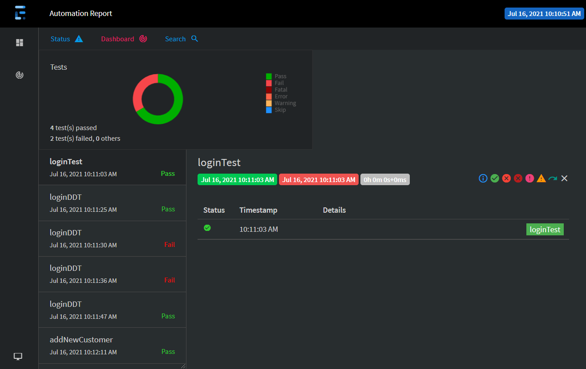
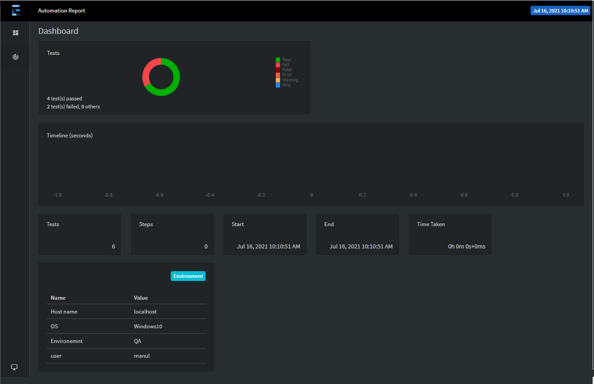

# Selenium-Java-Hybrid-Automation-Framework

[](https://github.com/mwickramanayaka/Selenium-Java-Hybrid-Automation-Framework/pulse)

## How to run
run
```bash
run.bat 
```
file
--------------------
type
```bash
"mvn clean install"
```
in terminal

## Tech Stack and main features
✅ Selenium4

✅ java

✅ TextNG

✅ page object model

✅ log4j2

✅ AutoIT

✅ Extent reports

✅ TestNG RetryAnalyzer

✅ Data driven testing using DataProvider TestNG

✅ multiple browser testing

 
 ## Extent Report Highlights

* Feature overview:
  <br>
    


* Capture error with screenshots:
  <br>
    

[Latest Report is Here🙂](https://youvegslabs/)

## Author
* **Manul Wickramanayaka** - [Linkedin](https://snd/) 
