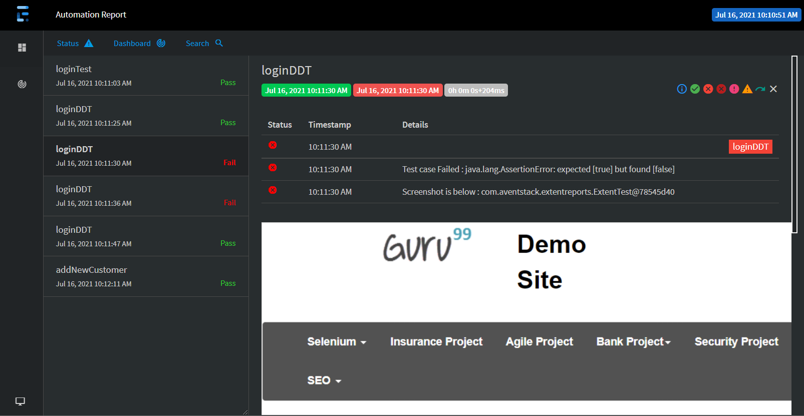

# Selenium-Java-Hybrid-Automation-Framework👨‍💻

## How to run
run
```bash
run.bat 
```
--------------------
type
```bash
"mvn clean install"
```
in terminal

## Tech Stack and main features
✅ Selenium4<br>
✅ java<br>
✅ TextNG<br>
✅ page object model<br>
✅ log4j2<br>
✅ AutoIT<br>
✅ Extent reports<br>
✅ TestNG RetryAnalyzer<br>
✅ Data driven testing using DataProvider TestNG<br>
✅ multiple browser testing<br>

 
 ## Extent Report Highlights

* Feature overview :
  <br>
    
    
 * Graphical overview :
  <br>
    

* Capture error with screenshots and logs :
  <br>
    
    * Capture error with screenshots and logs :
  <br>
    

## Author
* **Manul Wickramanayaka**  
* [Linkedin](https://www.linkedin.com/in/manul-wickramanayaka-812337132/) 
* 
